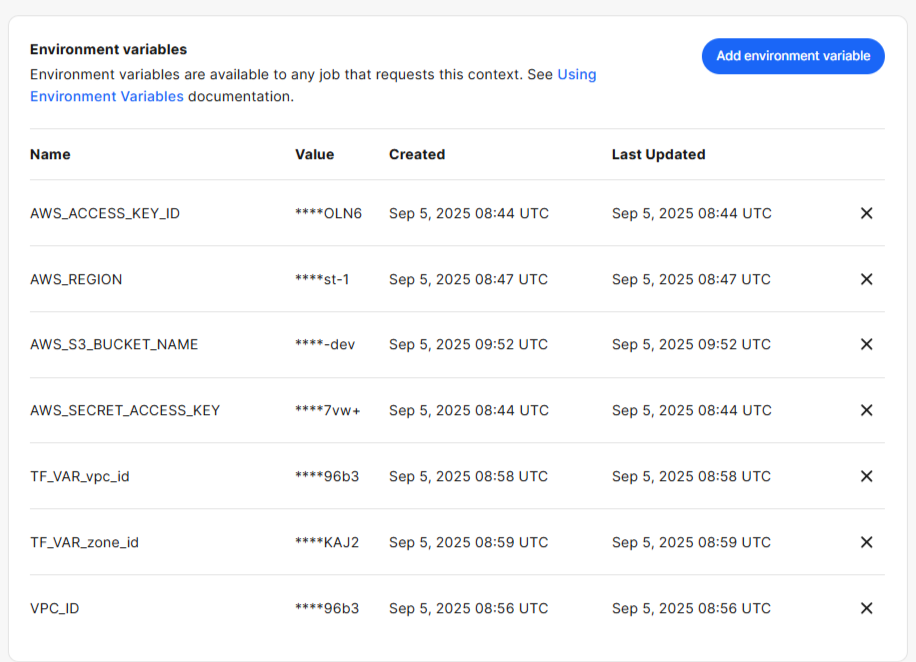
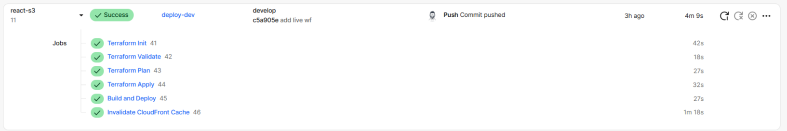
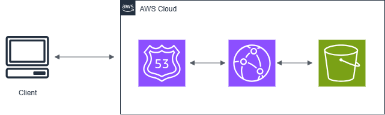
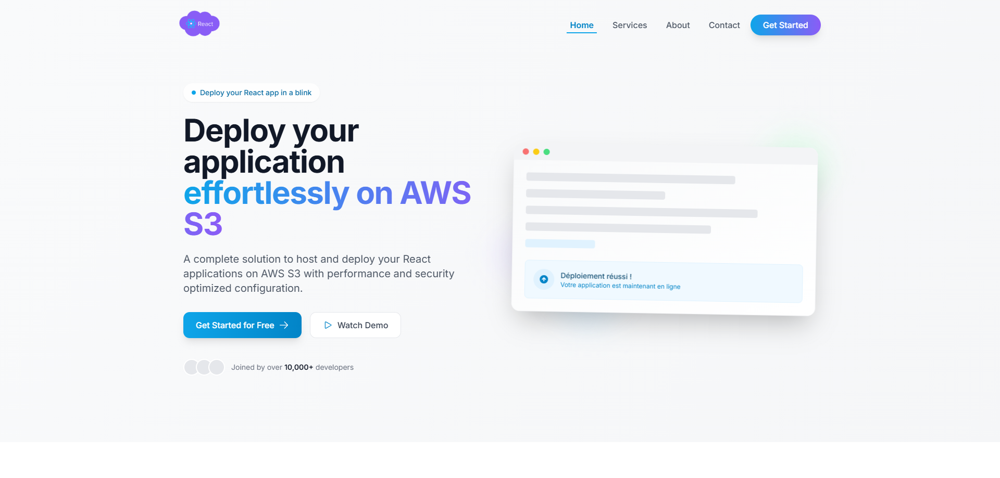
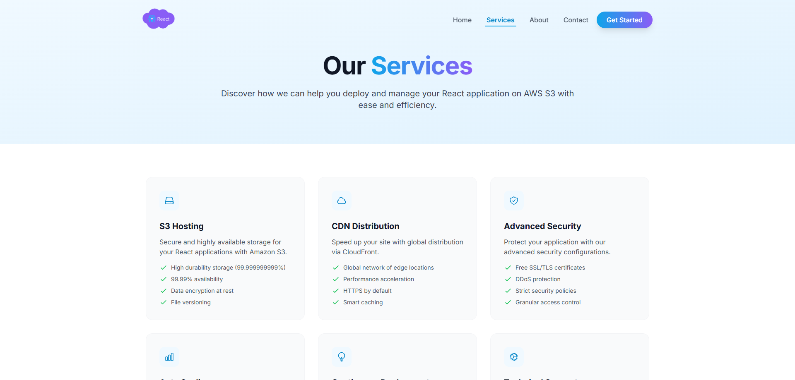

# React S3 Deployment Boilerplate

This is a modern React TypeScript application built with Vite, optimized for deployment on AWS S3 with CloudFront. It includes a complete configuration for both development and production, featuring a responsive design built with Tailwind CSS and smooth animations using Framer Motion.

## 🚀 Features

- ⚡ **Blazing Fast** - Built with Vite for lightning-fast development and production builds
- 🎨 **Modern UI** - Beautiful, responsive design with Tailwind CSS
- ✨ **Smooth Animations** - Powered by Framer Motion
- 🔄 **Client-Side Routing** - Using React Router v6
- 🛠 **Type-Safe** - Full TypeScript support
- 🧪 **Testing** - Set up with Vitest and React Testing Library
- 🚀 **Optimized for Production** - Ready for deployment to AWS S3 + CloudFront

## 🛠️ Tech Stack

- ⚛️ [React 19](https://reactjs.org/) with TypeScript
- 🎨 [Tailwind CSS](https://tailwindcss.com/) with official plugins
- ⚡ [Vite](https://vitejs.dev/) - Next Generation Frontend Tooling
- 🎭 [Framer Motion](https://www.framer.com/motion/) - Animation library
- 🔄 [React Router v7](https://reactrouter.com/) - Client-side routing
- 🧪 [Vitest](https://vitest.dev/) - Testing framework
- ☁️ AWS S3 + CloudFront - Deployment

## 🚀 Quick Start

### Prerequisites

- Node.js 18 or higher
- pnpm 8 or higher
- An AWS account (for deployment)
- CircleCI account (for CI/CD)

### 🚀 Getting Started

1. **Clone the repository**

   ```bash
   git clone https://github.com/devandcloud/react-s3.git
   cd react-s3
   ```

2. **Install dependencies**

   ```bash
   pnpm install
   ```

3. **Start the development server**

   ```bash
   pnpm dev
   ```

4. **Open in your browser**
   The app will be available at [http://localhost:3000](http://localhost:3000)

## 🏗️ Project Structure

```
react-s3/
├── app/                    # Main application code
│   ├── components/         # Reusable UI components
│   ├── pages/              # Page components
│   ├── assets/             # Static assets (images, fonts, etc.)
│   ├── App.tsx             # Main application component
│   └── main.tsx            # Application entry point
├── public/                 # Static files
│   └── index.html          # Main HTML file
├── .github/                # GitHub workflows and templates
├── .vscode/                # VSCode settings
├── node_modules/           # Dependencies
├── eslint.config.mts       # ESLint configuration
├── .gitignore             # Git ignore file
├── index.html              # Vite entry point (points to public/index.html)
├── package.json            # Project dependencies and scripts
├── postcss.config.mjs      # PostCSS configuration
├── tailwind.config.ts      # Tailwind CSS configuration
├── tsconfig.json           # TypeScript configuration
├── tsconfig.node.json      # TypeScript configuration for Node
└── vite.config.mts         # Vite configuration
```

## 🛠️ Available Commands

- `pnpm dev` - Start the development server
- `pnpm build:dev` - Build for production with DEPLOY_ENV=dev
- `pnpm build:live` - Build for production with DEPLOY_ENV=live
- `pnpm preview` - Preview the production build locally
- `pnpm test` - Run tests
- `pnpm test:watch` - Run tests in watch mode
- `pnpm test:coverage` - Generate test coverage report
- `pnpm lint` - Lint code
- `pnpm lint:fix` - Fix linting issues
- `pnpm format` - Format code

## 🏗️ Building for Production

To create an optimized production build:

```bash
pnpm build:dev # or pnpm build:live
```

This will create a production-ready build in the `build/` directory, which is ready to be deployed to AWS S3.

## ☁️ Deploying to AWS S3

6. **Set up VPC (if not already set up)**:
   - Create a VPC, example: `my-dev-vpc`
   - You should have your domain name registred on route53 (Hosted zone name)
   - CircleCI account & CircleCI context
7. **Set AWS credentials**:
   - Create an AWS access key and secret access key
   - Add the following environment variables to your CircleCI context:
     - AWS_ACCESS_KEY_ID
     - AWS_SECRET_ACCESS_KEY
     - AWS_REGION
     - AWS_S3_BUCKET_NAME

   See image below:

   

## 📄 License

This project is licensed under the MIT License. See the `LICENSE` file for more information.

## ✨ Author

- **Chokri** - [@choksel](https://github.com/choksel)

## 🎯 Related images

### CCI Pipeline:



### AWS Architecture:



### Web site screenshots:




