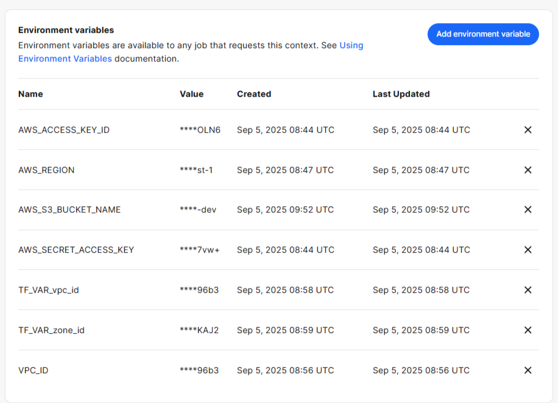
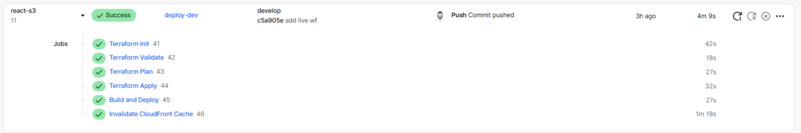
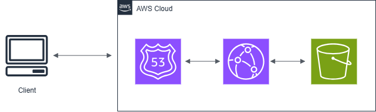
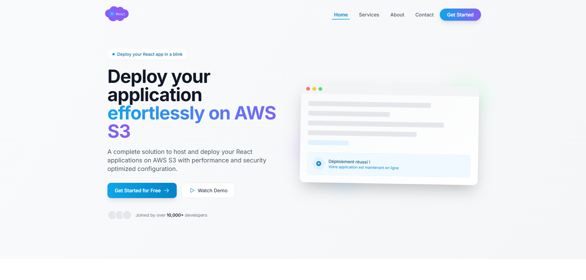
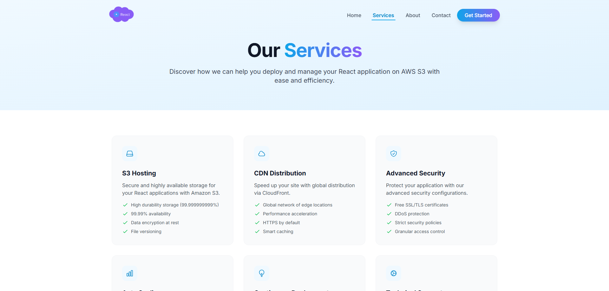

# React S3 Deployment Boilerplate

This is a modern React TypeScript application built with Vite, optimized for deployment on AWS S3 with CloudFront. It includes a complete configuration for both development and production, featuring a responsive design built with Tailwind CSS and smooth animations using Framer Motion.
## 🚀 Demo

- [React App on AWS S3 + CloudFront](https://react-s3-demo.devandcloud.com/?utm_source=github&utm_medium=social&utm_campaign=share-react-s3&utm_content=post2)
## 🚀 Features

- ⚡ **Blazing Fast** - Built with Vite for lightning-fast development and production builds
- 🎨 **Modern UI** - Beautiful, responsive design with Tailwind CSS
- ✨ **Smooth Animations** - Powered by Framer Motion
- 🔄 **Client-Side Routing** - Using React Router v6
- 🛠 **Type-Safe** - Full TypeScript support
- 🧪 **Testing** - Set up with Vitest and React Testing Library
- 🚀 **Optimized for Production** - Ready for deployment to AWS S3 + CloudFront

## 🛠️ Tech Stack

- ⚛️ [React 19](https://reactjs.org/) with TypeScript
- 🎨 [Tailwind CSS](https://tailwindcss.com/) with official plugins
- ⚡ [Vite](https://vitejs.dev/) - Next Generation Frontend Tooling
- 🎭 [Framer Motion](https://www.framer.com/motion/) - Animation library
- 🔄 [React Router v7](https://reactrouter.com/) - Client-side routing
- 🧪 [Vitest](https://vitest.dev/) - Testing framework
- ☁️ AWS S3 + CloudFront - Deployment

## 🚀 Quick Start

### Prerequisites

- Node.js 18 or higher
- pnpm 8 or higher
- An AWS account (for deployment)
- CircleCI account (for CI/CD)

### 🚀 Getting Started

1. **Clone the repository**

   ```bash
   git clone https://github.com/devandcloud/react-s3.git
   cd react-s3
   ```

2. **Install dependencies**

   ```bash
   pnpm install
   ```

3. **Start the development server**

   ```bash
   pnpm dev
   ```

4. **Open in your browser**
   The app will be available at [http://localhost:3000](http://localhost:3000)

## 🏗️ Project Structure

```
react-s3/
├── app/                    # Main application code
│   ├── components/         # Reusable UI components
│   ├── pages/              # Page components
│   ├── assets/             # Static assets (images, fonts, etc.)
│   ├── App.tsx             # Main application component
│   └── main.tsx            # Application entry point
├── public/                 # Static files
│   └── index.html          # Main HTML file
├── .github/                # GitHub workflows and templates
├── .vscode/                # VSCode settings
├── node_modules/           # Dependencies
├── eslint.config.mts       # ESLint configuration
├── .gitignore             # Git ignore file
├── index.html              # Vite entry point (points to public/index.html)
├── package.json            # Project dependencies and scripts
├── postcss.config.mjs      # PostCSS configuration
├── tailwind.config.ts      # Tailwind CSS configuration
├── tsconfig.json           # TypeScript configuration
├── tsconfig.node.json      # TypeScript configuration for Node
└── vite.config.mts         # Vite configuration
```

## 🛠️ Available Commands

- `pnpm dev` - Start the development server
- `pnpm build:dev` - Build for production with DEPLOY_ENV=dev
- `pnpm build:live` - Build for production with DEPLOY_ENV=live
- `pnpm preview` - Preview the production build locally
- `pnpm test` - Run tests
- `pnpm test:watch` - Run tests in watch mode
- `pnpm test:coverage` - Generate test coverage report
- `pnpm lint` - Lint code
- `pnpm lint:fix` - Fix linting issues
- `pnpm format` - Format code

## 🏗️ Building for Production

To create an optimized production build:

```bash
pnpm build:dev # or pnpm build:live
```

This will create a production-ready build in the `build/` directory, which is ready to be deployed to AWS S3.

## ☁️ Deploying to AWS S3

5. **Bootstrap Terraform Backend**:

   Before running Terraform for the first time, you need to bootstrap the backend. This will create the S3 bucket to store the remote state and the DynamoDB table for state locking. This step is only required once from your local environment.
   1. Go to the bootstrap directory:
   ```bash
   cd infra/bootstrap/
   ```
   2. Initialize Terraform with backend configuration:
   ```bash
   terraform init
   ```
   3. Preview the changes:
   ```bash
   terraform plan
   ```
   4. Apply the changes:
   ```bash
   terraform apply -auto-approve
   ```
   📢 Notes 

      This step is only required once to set up the remote backend.

      After bootstrapping, all subsequent runs can use terraform init to connect to the remote state.

      Ensure you have the necessary AWS permissions to create the S3 bucket and DynamoDB table.

6. **Set up VPC (if not already set up)**:
   - Create a VPC, example: `my-dev-vpc`
   - You should have your domain name registred on route53 (Hosted zone name)
   - CircleCI account & CircleCI context
7. **Set AWS credentials**:
   - Create an AWS access key and secret access key
   - Add the following environment variables to your CircleCI context:
     - AWS_ACCESS_KEY_ID
     - AWS_SECRET_ACCESS_KEY
     - AWS_REGION
     - AWS_S3_BUCKET_NAME
## Backend Lambda
@todo
##
   See image below:

   

## 📄 License

This project is licensed under the MIT License. See the `LICENSE` file for more information.

## ✨ Author

- **Chokri** - [@choksel](https://github.com/choksel)

## 🎯 Related images

### CCI Pipeline:



### AWS Architecture:



### Web site screenshots:




